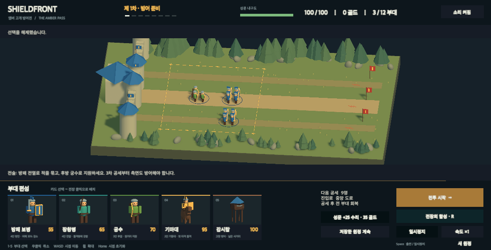
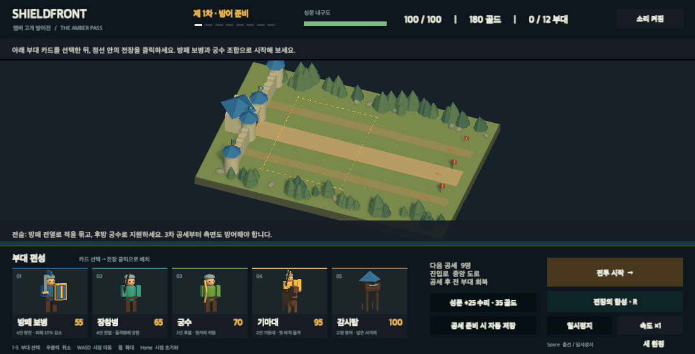
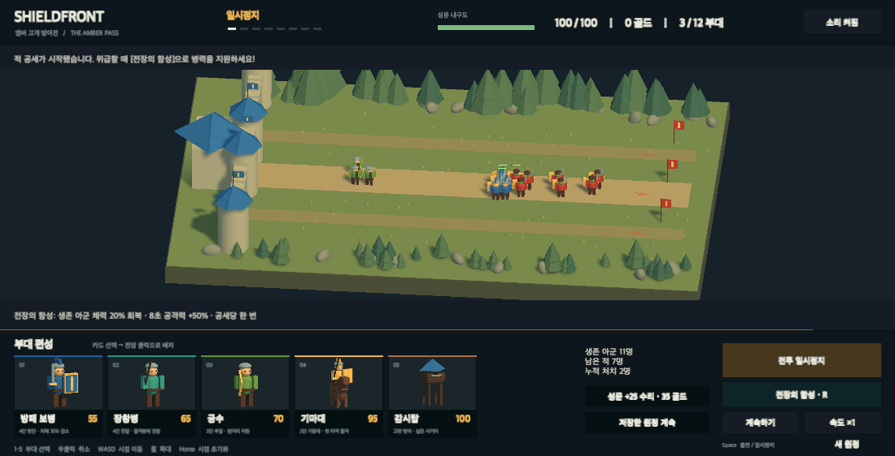

# Shieldfront · 앰버 고개 방어전

Unity 6 URP로 만든 3D 부대 배치형 본진 방어 게임입니다. 병사와 감시탑을 배치하고 8번의 공세로부터 성문을 지키세요.

## 게임 소개

앰버 고개의 성문을 8번의 몬스터 공세로부터 지키는 부대 배치형 3D 타워 디펜스입니다. 높은 시점에서 방패 보병·장창병·궁수·기마대·감시탑을 도로 길목에 배치하면 전투 시작과 함께 병사들이 자동으로 교전합니다. 공세를 하나씩 막을 때마다 골드 보상으로 증원·강화·성문 수리를 하고 다음 공세를 준비합니다.

- **8공세 완결 캠페인**: 시작부터 승리·패배·새 원정 재시작까지 하나의 전장에서 완결됩니다.
- **병종 상성**: 장창병은 늑대 돌격병에게 강하고, 방패 보병은 받는 피해를 35% 줄이며, 기마대는 첫 공격 피해가 큽니다.
- **전장의 함성**: 공세당 1회, 생존 아군을 회복하고 8초 동안 공격력을 올립니다.
- **자동 저장·이어하기**: 편성과 공세 종료 후 준비 상태를 로컬에 저장하고, 저장한 원정을 이어서 진행합니다.
- **원본 에셋**: 성채·지형·병사·장비와 보행·공격·사망 동작, 효과음까지 모두 코드로 생성한 로우폴리 원본입니다. 외부 에셋을 내려받지 않습니다.
- **한국어 uGUI**: 그림 카드와 상·하단 정보 UI를 한국어로 구성했습니다.

부대별 인원·가격·역할 수치는 [게임 기획](docs/GAME_DESIGN.md)을 참고하세요.

## 스크린샷

*카드를 골라 금색 점선 구역의 길목에 부대를 배치합니다.*

*공세 사이 준비 단계에서 증원·강화·성문 수리를 합니다.*

*전투 시작 후 배치한 병사들이 길목에서 적 공세와 교전합니다.*

## 바로 실행

### Unity 에디터

요구 사항: **Unity 6000.6.0f1** (Unity Hub 사용 권장). URP와 Input System 패키지는 프로젝트에 포함되어 있어 별도 설치가 필요 없습니다.

1. 저장소를 클론한 뒤, Unity Hub에서 **Add → 디스크에서 추가**로 클론한 **MonsterBattle** 폴더를 추가하고 엽니다.
2. 상단 메뉴 **Shieldfront → Open Game**을 누릅니다. 씬·빌드 설정·제품 이름·창 크기가 자동으로 구성됩니다. 또는 Project 창에서 **Assets → Scenes → Shieldfront**를 더블 클릭합니다.
3. 상단 **▶ Play**를 누릅니다. 필요한 카메라·전장·UI는 자동 생성됩니다.
4. Game 창이 너무 작으면 **Game 탭을 더블 클릭**하여 크게 보거나 창 레이아웃을 조절합니다.

### macOS 앱

빌드가 준비되면 **Builds/Shieldfront.app**을 Finder에서 더블 클릭합니다. Unity 에디터 없이 실행할 수 있습니다. 새로 빌드하려면 Play 모드를 종료하고 **Shieldfront → Build macOS Game**을 누릅니다.

## 첫 전투

1. 하단의 **방패 보병** 그림 카드를 클릭합니다.
2. 금색 점선 안의 중앙 도로를 클릭해 배치합니다. 성문은 왼쪽, 적 진입은 오른쪽입니다.
3. **궁수** 카드를 클릭하고 보병보다 성문 쪽에 배치합니다.
4. 오른쪽 아래 **전투 시작**을 누릅니다.
5. 위급하면 **전장의 함성**을 누릅니다. 공세마다 한 번 사용할 수 있습니다.
6. 공세를 막으면 전 부대가 회복됩니다. 보상으로 증원·강화·성문 수리를 하고 다음 전투를 시작합니다.

3차 공세부터는 위·아래 측면 도로에도 적이 옵니다. 한곳에 모든 병력을 몰지 않고 길목을 나누어 방어하세요.

## 조작

| 입력 | 동작 |
| --- | --- |
| 하단 카드 / 숫자 1–5 | 구매할 부대 선택 |
| 전장 왼쪽 클릭 | 선택 부대 구매·배치 / 기존 부대 선택·이동 |
| 우클릭 | 선택 취소 |
| 기존 부대 선택 후 강화 / 해산 | 등급 강화 / 골드 일부 회수 |
| Space | 준비 중 전투 시작, 전투 중 일시정지·재개 |
| R | 전장의 함성 |
| Escape | 준비 중 선택 취소, 전투 중 일시정지·재개 |
| WASD / 마우스 휠 | 카메라 이동 / 확대·축소 |
| Home | 기본 시점으로 복귀 |
| 속도 ×1 / ×2 | 전투 속도 전환 |
| 저장한 원정 계속 | 마지막 준비 상태 복원 |
| 새 원정 | 진행 중에는 두 번 눌러 초기화 확정 |

앱에서 다른 창으로 전환하면 전투가 일시정지됩니다. 돌아오면 자동으로 재개하며, 사용자가 직접 누른 일시정지는 유지합니다.

## 개발·수치 수정

**Assets → Shieldfront → Resources → DefenseRules**를 선택하면 Inspector에서 가격, 인원, 체력, 공격력, 공세 수와 보상을 조절할 수 있습니다. 처음에는 제공 기본값으로 플레이하세요.

- `Runtime/DefenseSimulation.cs`: 씬과 분리된 전투·경제·캠페인 규칙
- `Runtime/DefenseGame.cs`: 입력, 게임 흐름, 시각 효과와 효과음
- `Runtime/DefenseArt.cs`: 전장·병사 모델 생성과 애니메이션
- `Runtime/DefenseHUD.cs`: 그림 카드와 한국어 uGUI
- `Editor/DefenseProjectTools.cs`: 씬 생성, 캠페인 검증, macOS 빌드

기존 실험용 **SampleScene**과 **Assets/Scripts**는 보존되어 있으며 새 게임에서는 사용하지 않습니다.

## 검증

- Play 종료 후 **Shieldfront → Validate Campaign**: 경제·저장·상성·승패·8공세 완주 검사.
- Shieldfront에서 Play 중 **Shieldfront → Verify Running Game**: UI 레이캐스트·카드 클릭·배치·출전·일시정지·회복·저장 복원 통합 검사. 현재 플레이를 초기화하므로 확인용 실행에서 사용하세요. 기존 저장 슬롯은 검증 후 복원합니다.
- 결과 파일은 `docs/verification/`에 기록됩니다. 수행한 검증과 한계는 [PROGRESS](docs/PROGRESS.md)에 기록합니다.

[게임 기획](docs/GAME_DESIGN.md) · [진행 상태](docs/PROGRESS.md) · [에셋 출처](docs/ASSET_CREDITS.md)
